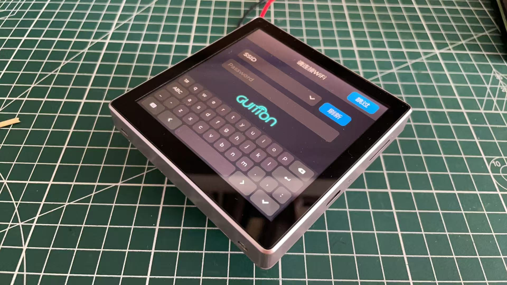

# ESP32-4.0inch_4848S040

online GUI design tool
https://www.guition.com/main/ 

There's a video that might help.
https://www.bilibili.com/video/BV19fwmeREQF/?share_source=copy_web&vd_source=99efd5b2b7c66214eaf3bfc18a284cab

There's another video that might help.
https://www.youtube.com/watch?v=ZLmQb7vWNfI&t=2s&ab_channel=nishad2m8

Alibaba link
https://www.alibaba.com/product-detail/86-Box-Smart-Home-Switch-Control_1601428880083.html?spm=a2747.product_manager.0.0.7b6171d2FHfouz
